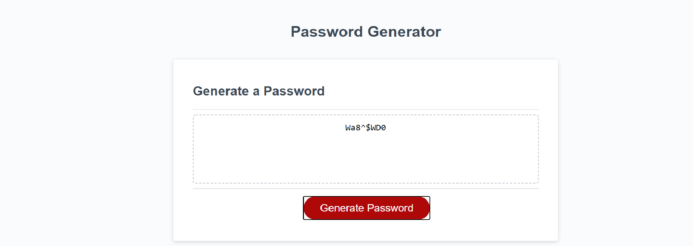

This is a description of the project. 
The project uses Javascript to generate a random password using a 4 different types of variables. 
The interface asks the user if the generated password should use uppercase letters, lowercase letters, numbers and or special characters.
The user then clicks OK to confirm their answers. 
If the user answers no to all 4 questions an error message is returned.
The user is then asked to confirm the length of their password between 8 and 128 characters.
A random password is then generated using the answers to the questions in 3.
The password is then displayed screen.

Screenshot

https://www.google.co.uk/?gws_rd=ssl